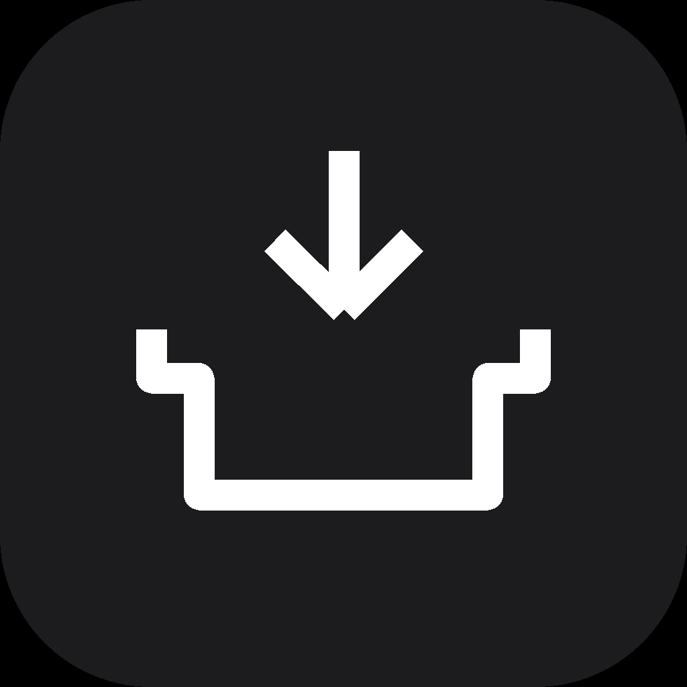

# NotchBar

<div align="center">
  
  <p align="center">
    <strong>Your MacBook notch, supercharged.</strong>
  </p>
</div>

NotchBar is a macOS utility that transforms the dead space around your MacBook notch into a functional hub for files, screenshots, and active clippings. Hover over the notch to reveal a tabbed interface for managing your workflow efficiently.

## Demonstration


## Key Features

- **File Drop Zone**: Drag and drop any file into the notch to store it temporarily for quick access.
- **Automated Screenshot Capture**: Automatically pulls new screenshots into a dedicated tab, reducing desktop clutter.
- **Tabbed Management**: Dedicated sections for Files, Screenshots, and Settings directly within the notch tray.
- **Smart Cleanup**: Configurable auto-clear timers to keep your workspace tidy without manual intervention.
- **Privacy Focused**: Operates locally on your machine with no external tracking or data collection.

## Getting Started

### Quick Install

Download and install NotchBar directly using the following command:

```bash
curl -L -O https://github.com/ammarjmahmood/notchbar/raw/main/website/NotchBar.dmg && open NotchBar.dmg
```

Alternatively, download the latest version from the [official website](https://notchbar.vercel.app).

### Development and Contribution

NotchBar is open-source and welcomes contributions. Whether you want to fix a bug, suggest a feature, or improve the documentation, your help is appreciated.

1. Clone the repository:
   ```bash
   git clone https://github.com/ammarjmahmood/notchbar.git
   ```
2. Open `NotchBar.xcodeproj` in Xcode.
3. Build and run the project.

We are preparing for a Product Hunt launch and encourage the community to contribute and help shape the future of NotchBar.

## Requirements

- macOS 14.0 or later
- MacBook with a hardware notch (optimized for recent MacBook Pro and Air models)

## License

This project is licensed under the MIT License.
